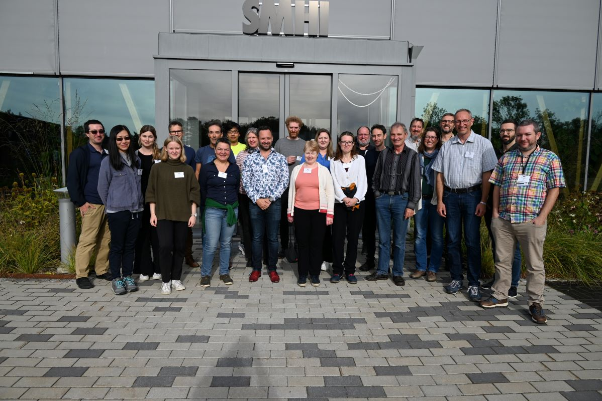
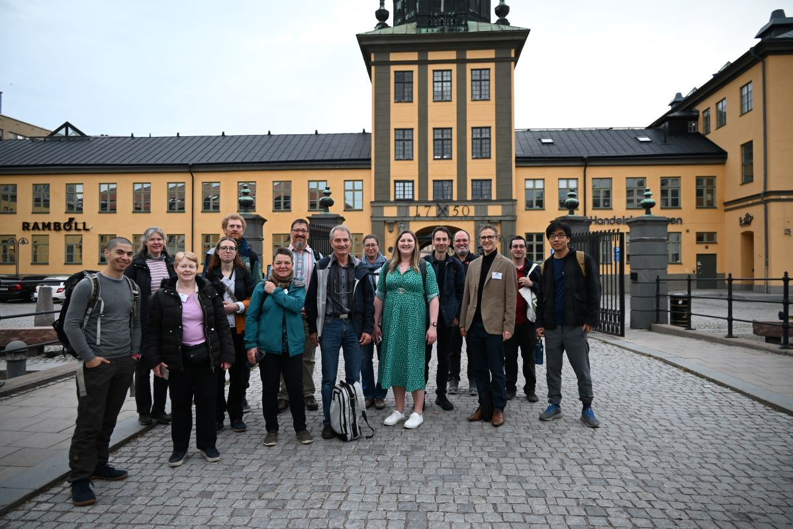
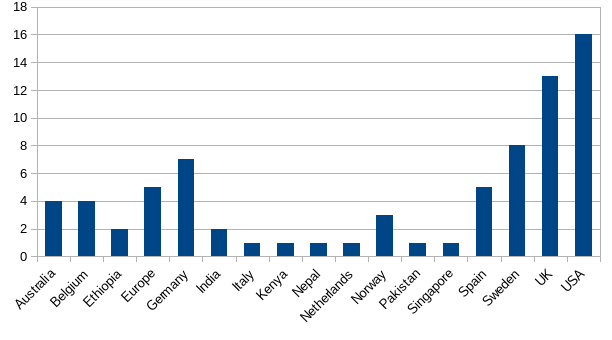

# 2024 CF Workshop

The 2024 CF workshop was held at SMHI, Norrköping, Sweden (and online) from Tuesday 17th to Friday 20th September 2024.
Further practical information about the workshop from the host institution can be found at the [SMHI CF Workshop page](https://www.smhi.se/en/research/research-departments/climate-research-at-the-rossby-centre/cf-community-workshop-2024-1.207332). 

The meeting was divided into two parts:

 - **Part 1 (17-18 September 2024): Engaging the cross-domain CF community to gather user needs and develop a high-level CF roadmap.**
 - **Part 2 (19-20 September 2024): Detailed CF development including hackathon sessions.**

During Part I, speakers were invited from a broad range of CF users and potential users, for example, representatives of data producers and data archives in the earth system sciences, the health and biological research communities. Part 2 followed the familiar format of our usual annual meeting.

The aim of the workshop was to maximise the usefulness of CF to a wide range of communities, encourage others to join and contribute to the CF community effort, and enhance interoperability with other widely used standards.
The desired outcome following the workshop will be a publication of the proceedings, including a roadmap for development of the CF conventions and vocabularies over the next 1 to 5 years.

## Attendees

A total of 78 participants registered for the workshop, with around 25-30 of these attending on-site. A breakdown of this information is shown in the following graph;
'Europe' refers to those representing a European organisation such as ECMWF, EUMETSAT or EMODnet.

A range of organisations were represented within the workshop: the affiliations of the presenters can be found underneath the agenda. 

## Documents

All the presentations and notes for the plenary and breakout sessions will be available in this [Google Drive folder][DOC].

The presentations from speakers in Part I are available on the [CF Metadata Conventions Zenodo repository][ZENODO].

----------------------------------------------------------------------------------------

## Agenda

In the first part each session began with 1-2 short (10 - 15 min each) keynote presentations to set the scene for the conversation. In addition, 1-2 brief "lightning talks" (5 min each) were given to highlight a particular perspective relevant to the conversation.

For the second part the agenda included a mixture of breakout group discussions and hands-on hackathons.

<table border="1px" id="preliminary-agenda">
  <thead>
    <tr>
      <th>&emsp;Time&emsp;</th>
      <th>&emsp;Session&emsp;</th>
      <th>&emsp;Speakers&emsp;</th>
    </tr>
  </thead>
  <tbody>
    <tr>
      <td> &emsp;CEST (UTC+2)&emsp;</td>
      <td> &emsp;<strong><em>Tuesday, 17 September</em></strong>&emsp;</td>
      <td>&emsp;&emsp;</td>
    </tr>
    <tr>
      <td>&emsp;&ensp;8:00 - &ensp;9:30&emsp;</td>
      <td>&emsp;Registration&emsp;</td>
      <td>&emsp;&emsp;</td>
    </tr>
    <tr>
      <td>
        &emsp;&ensp;9:30 - 10:30&emsp;
      </td>
      <td>
        &emsp;Opening session&emsp;
      </td>
      <td>
        &emsp;Lars Bärring: <em>Welcome, practicalities, format/structure/expectations of meeting</em>&emsp; 
        &emsp;David Hassell: <em>Setting the scene &ndash; overview of CF</em>&emsp;
      </td>
    </tr>
    <tr>
      <td>
        &emsp;10:30 - 11:00&emsp;
      </td>
      <td>
        &emsp;Break&emsp;
      </td>
      <td>
        &emsp;&emsp;
      </td>
    </tr>
    <tr>
      <td>
        &emsp;11:00 - 12:00&emsp;
      </td>
      <td>
        &emsp;Vocabularies&emsp;
      </td>
      <td>
          &emsp;Chair: Alison Pamment&emsp; 
          &emsp;<em>Keynote: Gwen Moncoiffe: CF Standard Names as a global semantic resource</em>&emsp; 
          &emsp;<em>Lightning talk: Liqing Jiang: Vocabulary needs of the ocean carbon and acidification community</em>&emsp;
      </td>
    </tr>
    <tr>
      <td>
        &emsp;12:00 - 13:00&emsp;
      </td>
      <td>
        &emsp;Units&emsp;
      </td>
      <td>
        &emsp;Chair: Alison Pamment&emsp; 
        &emsp;<em>Keynote: Stuart Chalk (virtual): Digital Units of Measurement: The Digital SI and Interoperable Units</em>&emsp; 
        &emsp;<em>Keynote: Chris Little (virtual): OGC Temporal Domain Working Group Activities</em>&emsp;
      </td>
    </tr>
    <tr>
      <td>
        &emsp;13:00 - 14:00&emsp;
      </td>
      <td>
        &emsp;Lunch&emsp;
      </td>
      <td>
        &emsp;&emsp;
      </td>
    </tr>
    <tr>
      <td>
        &emsp;14:00 - 15:30&emsp;
      </td>
      <td>
        &emsp;Uncertainty&emsp;
      </td>
      <td>
        &emsp;Chair: Antonio Cofiño&emsp; 
        &emsp;<em>Keynote: Charlotte Pascoe (virtual): Communicating (and understanding) uncertainty through the value chain</em>&emsp;  
        &emsp;<em>Keynote: David Huard (virtual): Metadata Pipelines in IPCC Assessment Reports</em>&emsp;
      </td>
    </tr>
    <tr>
      <td>
        &emsp;15:30 - 16:00&emsp;
      </td>
      <td>
        &emsp;Break&emsp;
      </td>
      <td>
        &emsp;&emsp;
      </td>
    </tr>
    <tr>
      <td>
        &emsp;16:00 - 17:30&emsp;
      </td>
      <td>
        &emsp;Metadata for describing&emsp; &emsp;statistical processing&emsp;
      </td>
      <td>
        &emsp;Chair: Lars Bärring&emsp; 
        &emsp;<em>Keynote: Christian Pagé: Metadata Challenges to properly address provenance in climate indices</em>&emsp; 
        &emsp;<em>Keynote: José Manuel Gutiérrez Llorente (virtual): Provenance for (complex) climate products: The experience from the IPCC Interactive Atlas</em>&emsp; 
        &emsp;<em>Lightning talk: Thomas Martin: Capturing provenance for ML</em>&emsp;
      </td>
    </tr>
    <tr>
      <td>
         &emsp;CEST (UTC+2)&emsp;
      </td>
      <td>
         &emsp;<strong><em>Wednesday, 18 September&emsp;</em></strong>&emsp;
      </td>
      <td>
        &emsp;&emsp;
      </td>
    </tr>
    <tr>
      <td>
        &emsp;&ensp;9:00 - 10:30&emsp;
      </td>
      <td>
        &emsp;Metadata requirements for&emsp; &emsp;new technologies&emsp;
      </td>
      <td>
        &emsp;Chair: Daniel Lee&emsp; 
        &emsp;<em>Keynote: Daniel Lee: Destination Earth Data Lake - Fueling Europe's Digital Twins</em>&emsp; 
        &emsp;<em>Lightning talk: Ag Stephens: Teaching Large Language Models to speak CF-NetCDF</em>&emsp; 
        &emsp;<em>Lightning talk: Jesús Fernández (virtual): Metadata requirements for high-resolution urban modelling</em>&emsp;
      </td>
    </tr>
    <tr>
      <td>
        &emsp;10:30 - 11:00&emsp;
      </td>
      <td>
        &emsp;Break&emsp;
      </td>
      <td>
        &emsp;&emsp;
      </td>
    </tr>
    <tr>
      <td>
        &emsp;11:00 - 12:30&emsp;
      </td>
      <td>
        &emsp;Interoperability and&emsp; 
        &emsp;cross format issues&emsp;
      </td>
      <td>
        &emsp;Chair: Ethan Davis&emsp; 
        &emsp;<em>Keynote: Sebastién Villaume: Mapping between GRIB and CF-netCDF and ECMWF software development plans</em>&emsp; 
        &emsp;<em>Keynote: Martina Stockhause: CF in the context of developments in the Research Data Alliance (RDA): RDA recommendations and CF opportunities</em>&emsp; 
        &emsp;<em>Lightning talk: Guillermo Tesoro Calvo: NetCDF-Schema: A general schema for defining and validating netCDF products</em>&emsp;
      </td>
    </tr>
    <tr>
      <td>
        &emsp;12:30 - 14:00&emsp;
      </td>
      <td>
        &emsp;Lunch&emsp;
      </td>
      <td>
        &emsp;&emsp;
      </td>
    </tr>
    <tr>
      <td>
        &emsp;14:00 - 15:30&emsp;
      </td>
      <td>
        &emsp;Cross-domain challenges&emsp; 
        &emsp;and opportunities&emsp;
      </td>
      <td>
        &emsp;Chair: Ellie Fisher&emsp; 
        &emsp;<em>Keynote: Luke Marsden: CF from the perspective of new discipline</em>&emsp; 
        &emsp;<em>Keynote: Martin Juckes (virtual): Challenges in the Expanding Scope of the CMIP Data Request</em>&emsp; 
        &emsp;<em>Lightning talk: Heiko Gölzer: Use of CF in the Ice Sheet Model Intercomparison Project (ISMIP)</em>&emsp;
      </td>
    </tr>
    <tr>
      <td>&emsp;15:30 - 16:00&emsp;</td>
      <td>&emsp;Break&emsp;</td>
      <td>&emsp;&emsp;</td>
    </tr>
    <tr>
      <td>&emsp;16:00 - 17:30&emsp;</td>
      <td>&emsp;Synthesis session&emsp;</td>
      <td>&emsp;Chair: David Hassell&emsp; &emsp;&emsp;</td>
    </tr>
    <tr>
      <td>&emsp;&emsp;</td>
      <td>&emsp;<em>End of first part</em>&emsp;</td>
      <td>&emsp;&emsp;</td>
    </tr>
    <tr>
      <td> &emsp;CEST (UTC+2)&emsp;</td>
      <td> &emsp;<strong><em>Thursday, 19 September</em></strong>&emsp;</td>
      <td>&emsp;&emsp;</td>
    </tr>
    <tr>
      <td>&emsp;&ensp;9:00 - 10&emsp;</td>
      <td>&emsp;Overview of CF news and &emsp; &emsp;introduction to hackathon sessions&emsp;</td>
      <td>
        &emsp;<em>Lars Bärring: Practical information for Part II</em>&emsp; 
        &emsp;<em>Jonathan Gregory: Brief introduction to the CF Committees</em>&emsp; 
        &emsp;<em>Jonathan Gregory: Review of CF-1.11 and preview of CF-1.12</em>&emsp; 
        &emsp;<em>Jonathan Gregory: New Vocabulary and Discussions repos &ndash; discussions vs. issues</em>&emsp; 
         &emsp;<em>Ethan Davis: Brief introduction to the CF Governance Panel, and to the CF Information Management and Support Team</em>&emsp; 
        &emsp;<em>Ethan Davis: DOI for the website and the conventions document</em>&emsp; 
        &emsp;<em>Hackathon conveners: Brief introduction to hackathon themes</em>&emsp;
      </td>
    </tr>
    <tr>
      <td>&emsp;10:00 - 12:30&emsp;</td>
      <td>&emsp;Hackathon sessions including break&emsp; 
       &emsp;<b>See <a href="https://drive.google.com/file/d/1qAoPLlF6nh7C_9kQZo19sIT6D-S7tA4Y/view?usp=drive_link">Google doc</a> for Zoom link to use for each hackathon</b>&emsp;</td>
      <td>&emsp;<em>Daniel Lee: "Good housekeeping": website & conventions text</em>&emsp;  
        &emsp;<em>David Hassell: HEALPix grids in CF</em>&emsp; 
        &emsp;<em>Guillermo Tesoro Calvo: NetCDF-Schema discussion</em>&emsp;</td>
    </tr>
    <tr>
      <td>&emsp;12:30 - 14:00&emsp;</td>
      <td>&emsp;Lunch&emsp;</td>
      <td>&emsp;&emsp;</td>
    </tr>
    <tr>
      <td>&emsp;14:00 - 17:30&emsp;</td>
      <td>&emsp;Hackathon sessions&emsp; &emsp;including break&emsp; 
      &emsp;<b>See <a href="https://drive.google.com/file/d/1qAoPLlF6nh7C_9kQZo19sIT6D-S7tA4Y/view?usp=drive_link">Google doc</a> for Zoom link to use for each hackathon</b>&emsp;</td>
      <td>&emsp;<em>David Hassell: CF roadmap/white paper</em>&emsp;</td>
    </tr>   
    <tr>
      <td/>
      <td/>
      <td> Dinner at 19:00 at <a href="https://www.thekniferestaurant.se/">The Knife!</a> <a href="https://docs.google.com/spreadsheets/d/1a7V5O-x7Ena0FLaBYlhew0nZ91ViUcmwSSv6UXDQv68/edit?gid=0#gid=0">Place your order online</a> by 13:30.</td>
    </tr>
    <tr>
      <td> &emsp;CEST (UTC+2)&emsp;</td>
      <td> &emsp;<strong><em>Friday, 20 September</em></strong>&emsp;</td>
      <td>&emsp;&emsp;</td>
    </tr>
    <tr>
      <td>&emsp;&ensp;9:30 - 12:30&emsp;</td>
      <td>&emsp;Hackathon sessions &emsp;including break&emsp; 
       &emsp;<b>See <a href="https://drive.google.com/file/d/1qAoPLlF6nh7C_9kQZo19sIT6D-S7tA4Y/view?usp=drive_link">Google doc</a> for Zoom link to use for each hackathon</b>&emsp;</td>
      <td>&emsp;<em>Daniel Lee: BCP-14</em>&emsp; 
        &emsp;<em>Alison Pamment: Standard names</em>&emsp; 
        &emsp;<em>Sadie Bartholomew: visualisations for standard names data</em>&emsp; 
        &emsp;<em>Ag Stephens: To create a high-quality dataset of CF-NetCDF file headers - to be used to train Machine Learning models</em>&emsp;</td>
    </tr>
    <tr>
      <td>&emsp;12:30 - 14:00&emsp;</td>
      <td>&emsp;Lunch&emsp;</td>
      <td>&emsp;&emsp;</td>
    </tr>
    <tr>
      <td>&emsp;14:00 - 15:00&emsp;</td>
      <td>&emsp;Hackathon wrap-up&emsp;</td>
      <td>&emsp;&emsp;</td>
    </tr>
    <tr>
      <td>&emsp;15:00 - 15:30&emsp;</td>
      <td>&emsp;Workshop wrap-up, including setting a deadline for release of CF-1.12&emsp;</td>
      <td>&emsp;&emsp;</td>
    </tr>
  </tbody>
</table>

#### About the presenters (part 1):

(In order of appearance)
* Lars Bärring: Senior Research Scientist, SMHI Rossby Centre, Sweden, and CF2024 Workshop local organiser
* David Hassell: Senior computational scientist, National Centre for Atmospheric Science (NCAS) & University of Reading, UK
* Gwen Moncoiffé: Senior Marine Data Manager and NERC Vocabulary Server Team Co-Lead,	BODC, National Oceanography Centre, Liverpool, UK
* Liqing Jiang: Associate Research Scientist, NOAA Cooperative Institute for Satellite Earth System Studies (CISESS), USA
* Stuart Chalk: Professor of Chemical Informatics, University of North Florida, USA, and Member CODATA Task Group on Digital Representation of Units of Measurement (DRUM)
* Chris Little: IT Fellow, UK Met Office, UK
* Charlotte Pascoe: Co-Lead CEDA Atmospheric Science, Centre for Environmental Data Analysis (CEDA), UK
* David Huard: Research and Innovation Support Specialist, Ouranos, Quebec, Canada, and IPCC TG-Data co-lead
* Christian Pagé: Research Engineer, CERFACS, Toulouse, France
* José Manuel Gutiérrez Llorente: Research Professor, Instituto de Física de Cantabria (IFCA), CSIC-University of Cantabria, and IPCC TG-Data Member and IPCC Atlas Lead
* Thomas Martin: Software Engineer, NSF Unidata, USA
* Daniel Lee: Data access systems operations manager, EUMETSAT, Germany
* Ag Stephens: Head of Partnerships,	Centre for Environmental Data Analysis (CEDA), UK
* Jesús Fernández: Research scientist, Instituto de Física de Cantabria (IFCA), CSIC-University of Cantabria, Spain
* Sebastién Villaume: Senior Data Scientist, ECMWF, UK
* Martina Stockhause: IPCC DDC Manager, German Climate Computing Center (DKRZ), Germany
* Guillermo Tesoro Calvo: Technical Manager, CS Communication & Systèmes, France
* Luke Marsden: Data Manager, Norwegian Meteorological Institute & University Centre in Svalbard, Norway
* Martin Juckes: NCAS Senior Research Scientist in Climate Data,	University of Oxford & Centre for Environmental Data Analysis (CEDA), UK
* Heiko Gölzer: Research Professor, Bjerknes Centre for Climate Research, Norway
* Jonathan Gregory: Senior scientist, NCAS, University of Reading, UK and Met Office Science Fellow, Exeter, UK
* Ethan Davis: Technical Manager, NSF Unidata, UCAR, USA, and CF Governance Panel Chair

 
#### Hackathon topics (part 2)
* BCP-14 [link][I258] (led by Daniel Lee)
* HEALPix grids in CF [link][I433] (led by David Hassell)
* “Good housekeeping!” - website & conventions text (led by Daniel Lee)
* Standard names (led by Alison Pamment)
* Visualisations for standard names data [link][I110] (led by Sadie Bartholomew)
* To create a high-quality dataset of CF-NetCDF file headers - to be used to train Machine Learning models (led by Ag Stephens)
* Roadmap / white paper discussion (open)

----------------------------------------------------------------------------------------

## The organising committee
* Alison Pamment, UKRI/NCAS/Centre for Environmental Data Analysis, UK 
* Daniel Lee, EUMETSAT, Germany 
* David Hassell, NCAS/University of Reading, UK 
* Ellie Fisher, NCAS/Centre for Environmental Data Analysis, UK 
* Ethan Davis, NSF Unidata, UCAR, USA 
* Kevin O'Brien, NOAA Affiliate, PMEL, University of Washington, USA
* Lars Bärring, Rossby Centre, SMHI, Sweden

[ISSUE]: https://github.com/cf-convention/discuss/issues/279
[CoC]: https://github.com/cf-convention/cf-conventions/blob/main/CODE_OF_CONDUCT.md
[I528]: https://github.com/cf-convention/cf-conventions/issues/528
[I258]: https://github.com/cf-convention/discuss/issues/258
[I433]: https://github.com/cf-convention/cf-conventions/issues/433
[I110]: https://github.com/cf-convention/cf-convention.github.io/issues/110
[DOC]: https://drive.google.com/drive/folders/1Z3eXgRsUYu6aXxyn5MSUraj5DXlQQYeQ
[ZENODO]: https://zenodo.org/communities/cfconventions/records

