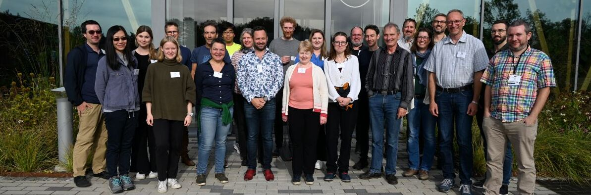

 

The CF metadata conventions are designed to promote the processing and sharing of files created with the [NetCDF API][https://www.unidata.ucar.edu/software/netcdf].
The conventions define metadata that provide a definitive description of what the data in each variable represents, and the spatial and temporal properties of the data.
This enables users of data from different sources to decide which quantities are comparable, and facilitates building applications with powerful extraction, regridding, and display capabilities.
The CF convention includes a standard name table, which defines strings that identify physical quantities.

Initially CF was developed for gridded data from climate and forecast models (hence "CF") of the atmosphere and ocean, but its use has subsequently extended to other geosciences, and to observations as well as numerical models.
The use of CF is recommended where applicable by Unidata.

---

<h4><a href="https://github.com/orgs/cf-convention/discussions/new?category=q-a-about-using-cf">Ask a question &#x2753; about how to use CF</a></h4>

<h3>Latest release (1.12)</h3>

<a href="Data/cf-conventions/cf-conventions-1.12/cf-conventions.html">HTML</a> 
<a href="Data/cf-conventions/cf-conventions-1.12/cf-conventions.pdf">PDF</a> 

<h3>Working draft</h3>

<a href="/cf-conventions/cf-conventions.html">HTML</a>
<a href="/cf-conventions/cf-conventions.pdf">PDF</a>

<h3>Latest vocabularies</h3>

<a href="Data/cf-standard-names/current/build/cf-standard-name-table.htm" class="btn btn-primary btn-lg">Standard names</a>
<a href="Data/area-type-table/current/build/area-type-table.html" class="btn btn-primary btn-lg">Area types</a>
<a href="Data/standardized-region-list/standardized-region-list.current.html" class="btn btn-primary btn-lg">Standarized regions</a>

<h2>Quick links</h2>

See also the links in the navigation bar at the top of this page.

<ul>

<li> <a href="https://github.com/orgs/cf-convention/discussions">CF GitHub Discussions</a>: announcements, forum for community discussion, questions and answers

<li> Current proposals for changing CF (CF GitHub issues): <a href="https://github.com/cf-convention/vocabularies/issues">vocabulary</a>
(including standard names), <a href="https://github.com/cf-convention/cf-conventions/issues">conventions</a>,
this <a href="https://github.com/cf-convention/cf-convention.github.io/issues">website</a> (including governance)

<li> <a href="https://github.com/cf-convention">CF GitHub organisation</a>

<li> <a href="faq.html">FAQ</a>

<li> <a href="software.html">List of software for working with CF</a>

<li> <a href="projects-activities.html">List of Projects and Activities that Use the CF Metadata Conventions</a>

<li> <a href="https://doi.org/10.5194/gmd-10-4619-2017">Paper</a> describing the CF data model and reference software

<li> Overview of CF basics
  <ul>

  <li> High-level presentation ([DOI](https://doi.org/10.5281/zenodo.15015065), [PDF](https://zenodo.org/records/15015065/files/2024-12_AGU_CF_OpenSciPrize_presentation.pdf?download=1&preview=1) - from 2024 AGU)

  <li> More detailed <a href="Data/cf-documents/overview/viewgraphs.pdf">presentation</a> and <a href="Data/cf-documents/overview/article.pdf">paper</a>

  </ul>
</ul>

---

## Get involved

CF is developed through open discussion on GitHub.
If you would like to propose a change, make a suggestion, report a problem or ask a question, please [see here][discussion.md].
Changes are decided according to the CF [governance arrangements][governance.md].
The CF community embraces a philosophy of producing excellence by maintaining an open and welcoming culture and an environment that promotes debate and inquiry in a respectful, bold and intellectually rigorous fashion.

{: style="max-width:800px; height:auto;" } &nbsp;*Members of the CF community at the 2024 conventions workshop*

---
