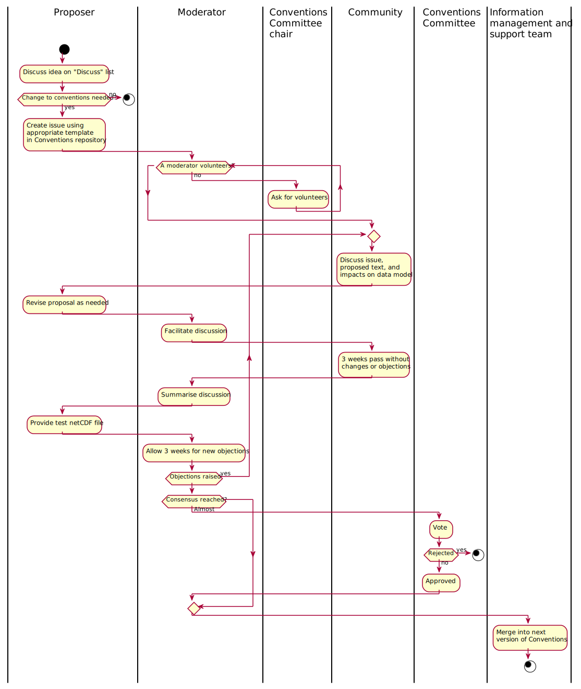

<!-- 
TODO:
https://github.com/cf-convention/cf-convention.github.io/issues/102#issuecomment-641318312:
- Decrease size of diagram
- Update diagram to include data model updates

https://github.com/cf-convention/cf-convention.github.io/issues/102#issuecomment-641346514:
- Switch labels
-->
# Rules for CF Conventions Changes
These are the rules for making changes to the CF Conventions. Note that errata and enhancements are treated via separate processes, detailed in separate sections of this page.
Discussions about changes to the CF Conventions, and all decisions pertaining to these, take place and are stored permanently on GitHub.
Additionally, all versions of the standard and conformance documents are kept available online with a history of changes.

Changes to [this website](https://github.com/cf-convention/cf-convention.github.io) are made according to the process described [in the repository's CONTRIBUTING.md file](https://github.com/cf-convention/cf-convention.github.io/blob/master/CONTRIBUTING.md).

## Enhancements
The rules for introducing enhancements into the CF Conventions are set forth in the following text and summarised in the figure below.

Enhancements to the [CF Conventions](https://github.com/cf-convention/cf-conventions) are proposed by raising an issue in the GitHub repository.
The repository contains a `CONTRIBUTING.md` file with guidelines on how this process is implemented using GitHub.
If in doubt, ask a question by raising an issue in the [CF Conventions Discussion forum](https://github.com/cf-convention/discuss) and the Community will help.

When a new proposal is made by raising GitHub issues, a suitably qualified person, such as a member of the Conventions Committee, volunteers to moderate the discussion.
If no-one volunteers, the chairman of the Committee asks someone to do it.

The discussion takes place in GitHub issues and all may participate.

The moderator periodically summarises the discussion on GitHub, keeps it moving forward, and tries to achieve a consensus.
It is expected that everyone with an interest will contribute to the discussion and to achieving a consensus during this stage.
During the discussion, if an objection is raised, answered and not reasserted, the moderator will assume the objection has been dropped.
However, since consensus is the best outcome, it will be helpful if anyone who expresses an objection explicitly withdraws it on changing their mind or deciding to accept the majority view.
The moderator can organize real-time interactions if this might help resolve an issue more quickly.

When three weeks have passed with no contributions being made, the moderator attempts to move toward a decision on the proposal by summarising the discussion and indicating the outcome as one of the following:

- Consensus: There is no outstanding objection, and at least three contributors have expressed support for it, including at least two members of the conventions committee.
If the moderator personally expresses support, they can be counted among the supporters.
- Near consensus: The conditions for consensus are not met but the moderator's summary is that consensus has nearly been achieved.
- Not near consensus.

The moderator will then invite further comment on the proposal, as summarised.
If further comments are made i.e. the discussion restarts, this step is repeated.
Once the summary has been made, if a test netCDF file does not yet exist, it must be created (unless deemed unnecessary or the summary suggests the proposal should be rejected).

When three weeks have passed with no contributions following a summary, and providing a test file exists, the issue is closed based on the outcome of the moderator's summary:
- Consensus: The proposal is accepted.
- Near consensus: The moderator calls for votes by the Conventions Committee and all members should vote.
The proposal is accepted if all, or all but one, members of the Conventions Committee vote in favour of it.
- Not near consensus: No change to standard.

If the change is accepted, the standard document and the conformance document, if needed, are updated.
The author of the proposal is added to the list of contributing authors of the CF Conventions.

## Errata
These rules apply to the CF conventions document, the conformance document, the standard name table and its guidelines.
They are applicable for correcting errors in these documents if it is clear that the text as it stands isn't what was agreed, because of a typographical or some other error.
They cannot be used to make substantive changes.

Errors in the standard names can alternatively be pointed out on the CF email list, and implemented by the manager of CF standard names (Alison) as part of a regular update.

If someone thinks there is an error in a document, they should open a GitHub issue of type "defect" to point it out and to state what should be done to the text in order to correct the error.
A corresponding GitHub pull request can also be submitted in addition to the issue.

The correction is held to have been agreed if three weeks pass without anyone disagreeing with it.
After that period, the issue should be closed by the manager of the CF conventions or the manager of CF standard names, who will make the change and/or merge the pull request.
No moderator is needed because there cannot be any substantive discussion under these rules.

If anyone disagrees that the correction should be made, because they think the document does have the intended meaning, then a correction cannot be made by these rules.
In that case the issue should be closed, and the change should be proposed as an enhancement instead, following the rules for making changes to the CF standard, if the proposer wants to pursue the issue.

